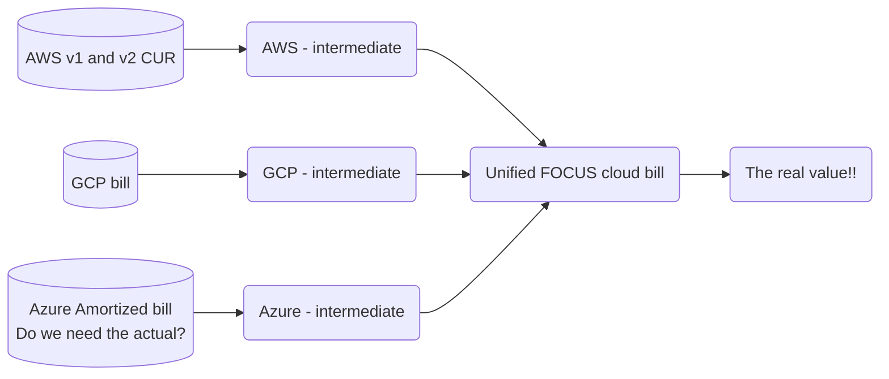

# The Open FinOps Stack

The goal of the Open FinOps Stack is to provide a welcoming first stop on the journey of a new FinOps practitioner.  FinOps is a very data heavy profession, and the market for FinOps tooling to help the new practitioner set up a baseline of data collection and reporting is well saturated.  The Open FinOps Stack aims to be a free, open-source alternative to these paid tools.

This is a simplified diagram, but the goal of the OFS is to make it easy for practitioners to get to a Unified cloud bill, per the FOCUS spec.