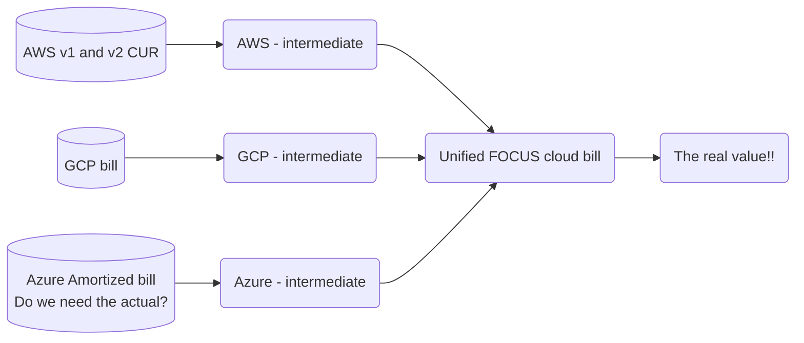

# The Open FinOps Stack

The goal of the Open FinOps Stack is to provide a welcoming first stop on the journey of a new FinOps practitioner.  FinOps is a very data heavy profession, and the market for FinOps tooling to help the new practitioner set up a baseline of data collection and reporting is well saturated.  The Open FinOps Stack aims to be a free, open-source alternative to these paid tools.

This is a simplified diagram, but the goal of the OFS is to make it easy for practitioners to get to a Unified cloud bill, per the FOCUS spec.

## Goals

- To handle the basic data engineering portion of FinOps - acquiring and keeping up to date the billing data.  Specifically, some Python scripts for pulling the billing data into a Clickhouse backend for storage and analysis.
- To provide a SQL-based framework for managing your company's billing and business logic.  This part will be a DBT install.
- To provide a nice BI dashboard to query and visualize your bills, and to store reports and dashboards built from these reports.  This will be a Metabase install.

In other words, to provide a packaged, open-source BI approach to FinOps and billing data visibility.

## Non-goals

- We will not provide a means of automatically managing your commitment based discounts, which is where many paid FinOps tools provide additional value on top of the cost visibility.